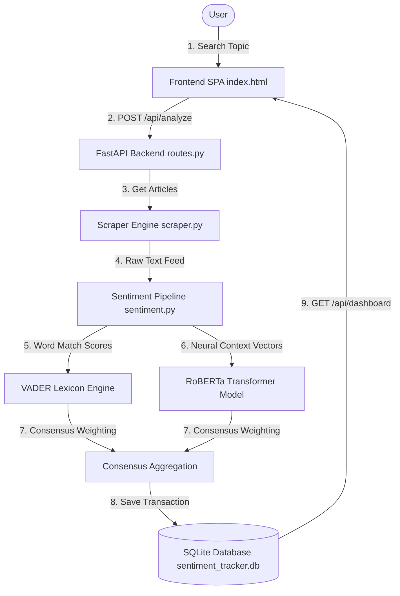
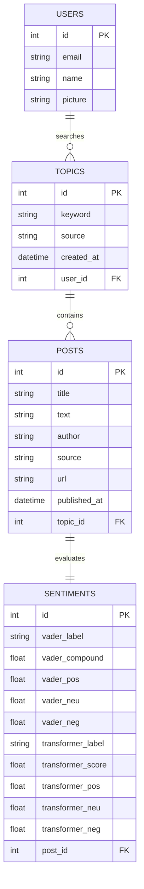

# SentioTrack Intelligence

SentioTrack is a real-time sentiment intelligence platform that aggregates articles and posts on any user-defined topic, performs dual-engine sentiment analysis (VADER Lexicon Rules + RoBERTa Deep Learning Transformer), and compiles sentiment metrics into a premium, interactive dashboard.

The application has been optimized into a single, high-performance static HTML template single-page application (SPA) served directly from the FastAPI backend, removing unnecessary build-tool complexity and ensuring extremely low latency.

---

## 🏗️ System Architecture Flow

The workflow below outlines how search queries are ingested, analyzed by the dual sentiment engines, and stored for visual rendering:



---

## 📊 Database Entity-Relationship (ER) Diagram

The SQLite database structure showing the user authentication mapping, search queries (topics), articles (posts), and engine classifications:



---

## ✨ Features

- **Consensus Metrics Visualizer:** Evaluates agreement between a dictionary-based scorer (**VADER**) and a context-aware model (**RoBERTa**), displaying positive/neutral/negative distributions with color-segmented horizontal bars.
- **Dynamic Term-Frequency Heatmap:** Analyzes scraping datasets to extract key positive and negative terms, displaying them with dynamic color opacity and weight based on term frequency.
- **Chronological Trend Graph:** Plots moving-average sentiment curves over time with precise hover tooltips and an explanatory valence legend.
- **Embedded Search History:** Accessible directly inside the profile popover card, showing a scrollable list of all previous sentiment scans with local timezone dates.
- **Clean Report View:** Hides global navigation elements on dashboard pages, replacing them with a minimal top-left "Back to Search" button.

---

## 🛠️ Tech Stack

- **Backend:** FastAPI (Python), Uvicorn, SQLAlchemy (SQLite ORM), PRAW (Reddit API), Requests (NewsAPI)
- **Database:** SQLite
- **Sentiment Engines:** NLTK VADER + HuggingFace `cardiffnlp/twitter-roberta-base-sentiment`
- **Frontend:** Vanilla HTML5, Tailwind CSS CDN, Chart.js, Google Hanken Grotesk & Geist Mono typography

---

## 📂 Project Structure

```
DS/
├── backend/
│   ├── .env               # API credentials & config
│   ├── database.py        # SQLAlchemy schema & SQLite init
│   ├── main.py            # FastAPI bootstrap, CORS, & SPA fallback
│   ├── routes.py          # REST endpoints (auth, topics, analysis, dashboard)
│   ├── scraper.py         # NewsAPI, Reddit, and MockScrapers
│   ├── sentiment.py       # VADER and RoBERTa wrappers with fallbacks
│   └── index.html         # High-performance Vanilla SPA template
└── sentiment_tracker.db   # Local SQLite Database file
```

---

## 🚀 Installation & Local Execution

### 1. Environment Configuration
The credentials are pre-configured in `backend/.env`. If you want to supply custom keys, edit the environment file:
```env
NEWSAPI_KEY=your_newsapi_key
HF_TOKEN=your_huggingface_token
GOOGLE_CLIENT_ID=your_google_oauth_client_id
GOOGLE_CLIENT_SECRET=your_google_oauth_client_secret
```

### 2. Execution Commands
1. Open a terminal in the project directory.
2. Install the backend Python dependencies:
   ```bash
   pip install -r backend/requirements.txt
   ```
3. Run the application:
   ```bash
   cd backend
   python main.py
   ```
4. Access the application in your browser at **[http://localhost:8000](http://localhost:8000)**.
